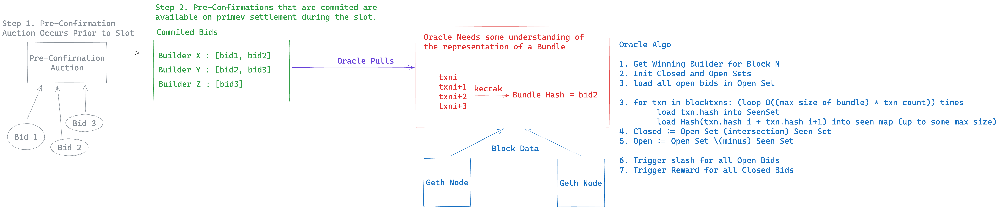

# Oracle




The core part of this service is the chain tracer, which has the following interface:
```
type Tracer interface {
	IncrementBlock() (NewBlockNumber int64)
	RetrieveDetails() (block *BlockDetails, BlockBuilder string, err error)
}
```

There are two implementations:
- DummyTracer
    - This is fed random data and can be changed to custom data for e2e testing
- IncrementingTracer
    - This is fed data from Infura (txns in block) and PayloadsDe (builder that won)


## Open Concerns on Oracle
- We need to have a reliable way of determining the winning builder.
